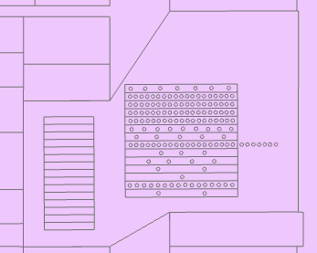
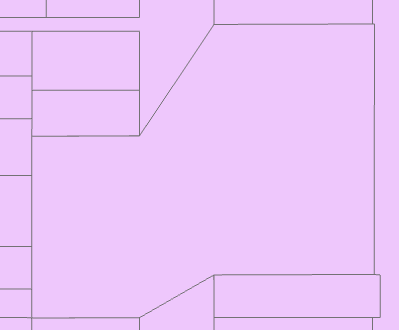

# OUGTools
*Lilah Rosenfield // WFRC*

 A set of tools to merge individually owned units into Owned Unit Groupings in a Parcel Dataset. Requires an ArcGIS Pro Advanced License.

## Step 0: Quickstart
This tool should run out of the box, with basic explanations of functions and requirement for parameters outlined within the toolbox. You can feel free to simply download a zip, extract it to a folder, and open the toolbox within your project. If you're wondering if this tool can serve your needs, aren't sure what an OUG is, or want some help understanding how this whole thing works, read on!

## Step 1: So you want to identify new residential units
Here at WFRC, we Here at WFRC, we maintain a variety of datasets and models intended to support our work guiding and supporting the future of transportation and development along the Wasatch Front.

One such dataset is the [Housing Unit Inventory](https://gis.utah.gov/data/planning/housing-unit-inventory/). This dataset is derived from the existing assessor LIR dataset, but includes modifications and derived values to help us, our partners and members of the community understand evolving housing patterns.

One such modification we make when producing this inventory is merging certain parcels into what we call *Owned Unit Groupings* or OUGs.

### The What?

You see, assessors are responsible primarily for identifying taxable property, and while the data they produce is quite useful for other purposes, it is still primarily created for that role. This means that *each independently owned unit* needs to have its own feature. This works fine for single-family residential units and for apartments owned by a single entity, but for multi-family dwellings, *especially* mid-rise and high-rise condominiums, this poses a challenge for representation on a two-dimensional map.

For assessors, this issue is typically resolved assigning individually owned units to features with entirely or partially fictive geometries within the true geometry of the parcel[^1] owned by the HOA, collaborative governance structure, or developer (we'll call this big parcel the **Common Parcel** or **CmP**, and the smaller, potentially geometrically fictive parcels the **Unit Parcels** or **UnP**). Typically it looks something like this.

    
     
    ew.

The thing is, for our purposes, we don't actually care about who owns specific parcels, and we'd like to be able to make direct comparisons between, for example, multi-family condos and apartments. Enter,the Owned Unit Grouping. This is, most simply, a version of the Common Parcel that incorporates certain information from the Unit Parcels within it (most importantly, a count of all housing units).

## Part 2: That's just a dissolve, right?
At its most basic, yes. This is just a dissolve between the Common Parcels and the Unit Parcels. But right away we face some issues. I was working to *update* the dataset, which means the preprocessing we'd done had eliminated unmodified parcels, including some Common Parcels I needed to merge. Said parcels were still present in the overall LIR Dataset, but dissolve only works if every feature is on the same layer. Additionally, because of the number of edge cases that were likely to emerge, I felt it was important to work through each OUG one-by-one so I could identify issues as they arose.

Instead of going through a multi-step process of manual selection, appending the wider parcel, and then dissolving for all 6000 newly built units, I decided that it'd be better to simply build out a tool that allowed me to select a CmP and run all relevant processes. Enter...

## Part 3: The Parcel Review Toolbox
ArcGIS provides a number of excellent tools for scripting. After playing around with a couple of different options, I eventually settled on scripting a [script tool](https://pro.arcgis.com/en/pro-app/latest/arcpy/geoprocessing_and_python/a-quick-tour-of-creating-script-tools.htm) with Python operating on an ArcToolbox. The results of this adventure are the collection of scripts and the toolbox located in this repository.

This toolbox contains two important tools (the third, Conform Attribute Table, I didn't end up using or testing, but I didn't want to go to waste. Feel free to take a gander at the code and see if you'd find it useful).

### Selection to OUG
This is the more simple of the two tools, and is basically just a wrapper for Dissolve that replaces the dissolved features in the existing layer, rather than creating a new feature set. Still quite useful if you ask me, but not too complicated, and as such, likely to work relatively smoothly.

### Common Parcel to OUG
This is the big one. Here's the short version of what it does:
- Takes a single selected feature from one layer (the Common Parcel), and removes all interior parts
- Identifies all features from a different layer (the Unit Parcels) that exist spatially *within* the selected feature
- Appends the Common Parcel feature to the dataset containing the Unit Parcels
- Dissolves them all together using the provided field map
- Tags the newly dissolved feature (shaped like the common parcel, but with additional information) as an OUG, and identifies it as having been processed by this tool
- Deletes the Unit Parcels from the Unit parcel layer
- Appends the OUG back onto the unit parcel layer

On top of this basic process, there's some setup as well as some error checking to ensure that (for example) you don't merge every feature in your dataset into one big blob.[^2] Once all this is done, the outcome should be a single feature that serves as an Owned Unit Grouping, like so:

    
     
    Much Better!

## Part 4: Debugging
Hopefully you'll find that any issues relating to user input produce clearly understandable errors in the geoprocessing history log, which provide clear direction for fixing any issues. If you get just a traceback, you'll probably have to dig into the code to figure out what's going on. I've tried to clearly document all my functions, so it shouldn't be too hard.

If you think you've found an issue of unexpected behavior in the face of correct inputs, you're welcome to open an issue or create a pull request, though I can't guarantee anyone will get to it.

### Common Issues

A couple of common problems you may encounter:

#### Input Field Map Parameter
I really can't emphasize enough that *all fields* where *different Unit Parcels are going to have different values* **need** to have an operation set. The tool will fail if you don't have this, and it will let you know. That said, don't rely on this as a guarantee of consistency: *the common parcel does not have this check*, so if all your units have the same value, and the common parcel has a different value, then the new OUG will silently inherit the value *from the Unit Parcels*. 

#### Common parcel fields
Also note that only default field mapping occurs when the Common Parcel is appended to the Unit Parcel. This means that if you want the data the Common Parcel in a given field incorporated *at all* you need to make sure that both the Field Name and Field Data Type are *exactly the same* as a given field in the dataset for the Unit parcels. If there is a field in the Common Parcel dataset that does not *exactly* match a field from the Unit Parcel dataset, then the merged OUG will not incorporate the values from that field at all.

#### String Typing
Probably the most common (and irritating) issue you may encounter is that of text-encoded numerical fields. Unlike raw python, where dynamic typing tends to smooth over some issues, fields in ArcGIS are strictly typed. Some fields in the assessor data I was working with contained attributes that were primarily numerical in character, but with a field itself that had the data type 'text.' This meant that I was not able to run certain dissolve functions (like sum) on said data. To fix this, create a new field with the desired type, and use the Calculate Field geoprocessing tool with Python's int() builtin on the original field.

#### Numerical Type Differences
For some reason, the Dissolve Geoprocessing tool casts dissolved fields that have been summed from integers to floats. This led to some modifications to the interim processing between dissolving and appending the OUG that resolved the issue, but may cause problems in certain edge cases. If you're having problems related to unmatched schema in the final append step, I'd check `unionmerge.field_map_for_dicts()`, and see if adjusting the typing logic might help fix some things.

## Part 5: Future Steps
I made this tool during an internship with WFRC's excellent analytics group, and have left it in their capable hands. That said, there are potentially some changes that I would have loved to make. 

First off (and perhaps most obviously), if I'd needed to work with tens of thousands rather than thousands of parcels, it may have been worth it to figure out a way to automate the identification of parcels that need to be OUG'd, such that the tool could be run once per county. If someone at another MPO or other organization that works with parcel data figures out a way to do so consistently, feel free to put in a PR! If you do make modifications, consider bumping the `unionmerge.PROCESSOR_VERSION` constant.

Also: this tool requires an ArcGIS Pro Advanced license to run the Eliminate Polygon Part tool, if you can figure out a drop-in replacement for this tool, or another way to perform the equivalent function, also drop a pull request!

[^1]: Because this toolbox was originally developed for use with Land Information Record parcels, I use the term 'parcel' and the term 'feature' somewhat interchangeably throughout this document. While I'm sure many philosophers would cringe at my blurring of the distinction between a representation of a concept (a feature on a GIS map) and the concept itself (the pseudo-arbitrary division of land into salable units), I trust the reader will be able to follow my intentions well enough, and will leave the philosophy of mapmaking to [Borges](https://sites.williams.edu/thea228/research/textual-research/borges-of-exactitude-in-science/).
 
[^2]: Such action is, in fact [frowned upon](https://en.wikipedia.org/wiki/Fifth_Amendment_to_the_United_States_Constitution) in the United States.